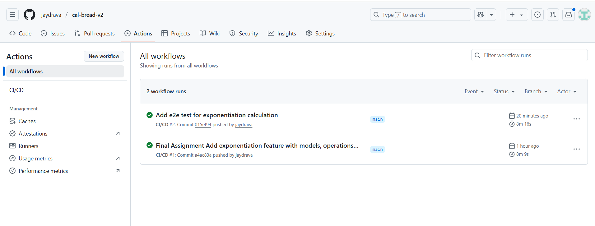

# FastAPI Calculator with BREAD Operations
## Overview
This project is a FastAPI-based calculator application implementing BREAD (Browse, Read, Edit, Add, Delete) endpoints for managing calculations. It includes authentication, containerization with Docker, CI/CD via GitHub Actions, and deployment to Docker Hub.

# 📦 Project Setup

---

# 🧩 1. Install Homebrew (Mac Only)

> Skip this step if you're on Windows.

Homebrew is a package manager for macOS.
You’ll use it to easily install Git, Python, Docker, etc.

**Install Homebrew:**

```bash
/bin/bash -c "$(curl -fsSL https://raw.githubusercontent.com/Homebrew/install/HEAD/install.sh)"
```

**Verify Homebrew:**

```bash
brew --version
```

If you see a version number, you're good to go.

---

# 🧩 2. Install and Configure Git

## Install Git

- **MacOS (using Homebrew)**

```bash
brew install git
```

- **Windows**

Download and install [Git for Windows](https://git-scm.com/download/win).
Accept the default options during installation.

**Verify Git:**

```bash
git --version
```

---

## Configure Git Globals

Set your name and email so Git tracks your commits properly:

```bash
git config --global user.name "Your Name"
git config --global user.email "your_email@example.com"
```

Confirm the settings:

```bash
git config --list
```

---

## Generate SSH Keys and Connect to GitHub

> Only do this once per machine.

1. Generate a new SSH key:

```bash
ssh-keygen -t ed25519 -C "your_email@example.com"
```

(Press Enter at all prompts.)

2. Start the SSH agent:

```bash
eval "$(ssh-agent -s)"
```

3. Add the SSH private key to the agent:

```bash
ssh-add ~/.ssh/id_ed25519
```

4. Copy your SSH public key:

- **Mac/Linux:**

```bash
cat ~/.ssh/id_ed25519.pub | pbcopy
```

- **Windows (Git Bash):**

```bash
cat ~/.ssh/id_ed25519.pub | clip
```

5. Add the key to your GitHub account:
   - Go to [GitHub SSH Settings](https://github.com/settings/keys)
   - Click **New SSH Key**, paste the key, save.

6. Test the connection:

```bash
ssh -T git@github.com
```

You should see a success message.

---

# 🧩 3. Clone the Repository

Now you can safely clone the course project:

```bash
git clone <repository-url>
cd <repository-directory>
```

---

# 🛠️ 4. Install Python 3.10+

## Install Python

- **MacOS (Homebrew)**

```bash
brew install python
```

- **Windows**

Download and install [Python for Windows](https://www.python.org/downloads/).
✅ Make sure you **check the box** `Add Python to PATH` during setup.

**Verify Python:**

```bash
python3 --version
```
or
```bash
python --version
```

---

## Create and Activate a Virtual Environment

(Optional but recommended)

```bash
python3 -m venv venv
source venv/bin/activate   # Mac/Linux
venv\Scripts\activate.bat  # Windows
```

### Install Required Packages

```bash
pip install -r requirements.txt
```
### Run the Application

```bash

```
The app will be available at:
http://localhost:8000
---

# 🐳 5. (Optional) Docker Setup

> Skip if Docker isn't used in this module.

## Install Docker

- [Install Docker Desktop for Mac](https://www.docker.com/products/docker-desktop/)
- [Install Docker Desktop for Windows](https://www.docker.com/products/docker-desktop/)

## Build Docker Image

```bash
docker build -t <image-name> .
```

## Run Docker Container

```bash
docker run -it --rm <image-name>
```

---

# 🚀 6. Running the Project

- **Without Docker**:

```bash
python main.py
uvicorn app.main:app --reload
```
The app will be available at:
http://localhost:8000
(or update this if the main script is different.)

- **With Docker**:

```bash
docker run -it --rm <image-name>
```

---

# 📝 7. Submission Instructions

After finishing your work:

```bash
git add .
git commit -m "Complete Module X"
git push origin main
```

Then submit the GitHub repository link as instructed.

---
#     8. Running Tests Locally
```bash
pytest
```
---

#     9. Links
   Docker Hub Repository: https://hub.docker.com/repository/docker/jaydrava/module14-app/tags
   GitHub Repository: https://github.com/jaydrava/cal-bread-app.git

# 📋 Notes and Screenshots




Check Reflection.pdf for more details about project and challenges
---

# 📎 Quick Links

- [Homebrew](https://brew.sh/)
- [Git Downloads](https://git-scm.com/downloads)
- [Python Downloads](https://www.python.org/downloads/)
- [Docker Desktop](https://www.docker.com/products/docker-desktop/)
- [GitHub SSH Setup Guide](https://docs.github.com/en/authentication/connecting-to-github-with-ssh)
